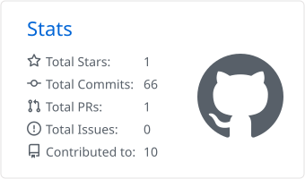
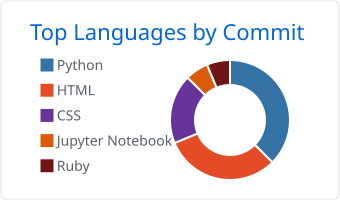
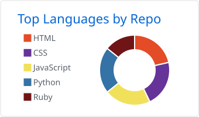
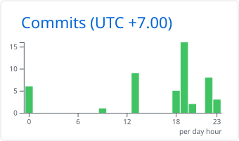

# Hi! 👋 My name is Yanisa Prathumsuwan

### Computer Science Graduate from Silpakorn University

Recent Computer Science graduate with hands-on experience in **front-end and full-stack web development**. Skilled in building web applications, REST API integration, and database management. Passionate about creating user-friendly applications and turning ideas into functional software solutions.

---

## 💻 Technical Skills

**Programming Languages**
Python · JavaScript · Java · Go · PHP · Dart · C

**Mobile / Web Development**
ASP.NET Core MVC · Flutter · HTML5 · CSS3 · JavaScript · Node.js · RESTful API Integration

**Database**
Microsoft SQL Server (MSSQL) · MySQL · PostgreSQL · MongoDB

**Data Analysis**
SQL · Pandas · NumPy

**Design Tools**
Figma · Canva

**Other Skills**
Problem-solving · Creativity · Adaptability · Time Management · Communication · Initiative

**Languages**
Thai (Native) · English (Communicative)

---

## 🌐 Socials

  
  &nbsp;
  

---

## 📊 GitHub Stats

  
  

  
  

---

  <i>Building things, learning constantly, and turning ideas into reality.</i>

  ♡ Thanks for visiting my profile ♡

